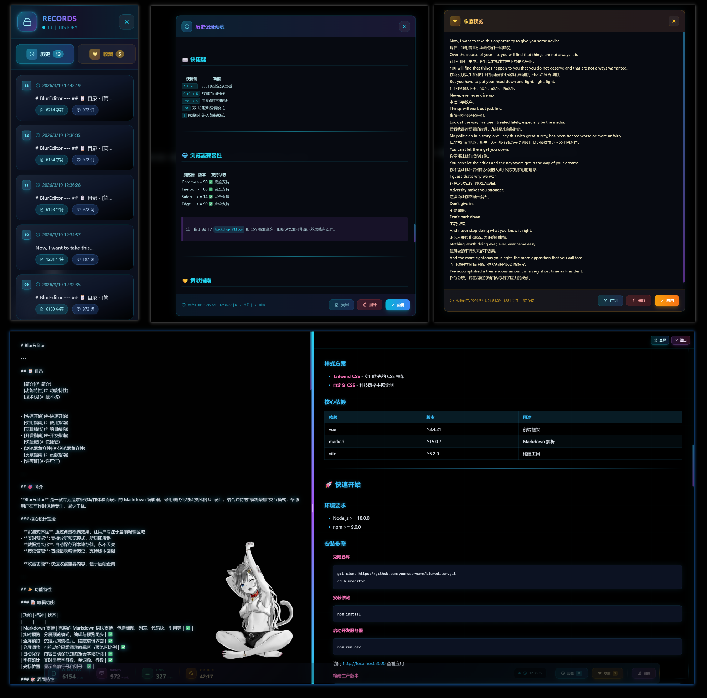

# BlurEditor

<div align="center">
  
  <p><em>一个面向本地写作、资料整理和 Markdown 阅读的知识工作台</em></p>
</div>

---

## 项目定位

**BlurEditor** 不是单纯的沉浸式文本输入框，而是一个运行在浏览器里的 **本地 Markdown 知识工作台**。它把文档管理、标签页编辑、Markdown 预览、统一搜索入口和导入导出放在同一个界面里，适合用来管理个人笔记、项目文档、会议纪要、技术草稿和长期积累的 Markdown 资料。

当前版本采用本地优先的使用方式：文档内容、文件树和界面偏好保存在浏览器本地存储中，不依赖后端服务，也不会主动上传内容。

## 适合场景

- 维护一组本地 Markdown 文档，而不是只编辑单篇临时文本
- 在写作时同时查看文件树、标签页、文档大纲和预览效果
- 快速搜索所有文档内容，并从结果跳转到目标文档
- 将已有 `.md`、`.txt`、`.html` 文件导入工作区继续整理
- 将文档导出为 Markdown、HTML、TXT 或富文本内容

## 核心能力

### 本地文档工作区

- 文件和文件夹管理：新建、重命名、移动、复制、归档和恢复
- 收藏区：把高频文档固定到侧边栏，方便快速回到常用内容
- 打开记录：记录文档访问时间，用于收藏区和相关列表的排序
- 文件排序：支持按名称、更新时间和内容大小排序
- 本地持久化：自动保存到浏览器 `localStorage`

### Markdown 编辑与阅读

- 单文档编辑、标签页切换和标签页关闭管理
- 分栏预览、全屏预览和禅模式阅读
- 文档大纲解析，支持标题层级和滚动联动
- 代码块高亮和代码复制
- Mermaid 图表渲染
- 预览页宽、字体、字号和行高设置

### 搜索与命令

- 左侧文件名搜索，用于快速定位文档
- 全局正文搜索，支持结果预览和键盘导航
- 全局入口，集中搜索命令、文件、正文和标签
- 多主题切换，支持深色与浅色主题序列

### 导入导出

- 支持导入 `.md`、`.txt`、`.html`
- 支持导出 Markdown、HTML、TXT
- 支持复制/导出富文本内容，便于粘贴到外部编辑器

## 技术栈

- **Vue 3**：基于 Composition API 组织编辑器、文件管理和弹窗状态
- **Vite**：开发服务器与生产构建
- **Marked**：Markdown 解析
- **Highlight.js**：代码块高亮
- **Mermaid**：图表渲染
- **Tailwind CSS + 自定义 CSS**：界面布局、主题和动效

## 快速开始

### 环境要求

- Node.js >= 18
- npm >= 9

### 安装与运行

```bash
npm install
npm run dev
```

默认访问地址：

```text
http://localhost:3000
```

生产构建：

```bash
npm run build
```

本地预览构建结果：

```bash
npm run preview
```

## 使用入口

- **新建文档/文件夹**：左侧文件管理顶部的加号按钮，或通过全局入口执行
- **首次开始**：右下角快速开始面板可直接创建空白文档、日报、会议纪要或技术文档模板
- **导入文件**：左侧导入按钮，支持点击选择或拖拽文件
- **全局入口**：`Ctrl/Cmd + K` 或 `Alt + G`，搜索命令、文件、正文和标签
- **编辑/预览切换**：`Alt + V`
- **分屏模式切换**：`Alt + S`
- **预览 Vim 快捷键**：预览模式下可用 `j/k`、`gg/G`、`d/u`、`Space/Shift+Space`、`{/}`、`/`、`q/Esc`
- **文档大纲**：编辑器右上角大纲按钮，或 `Alt + H`
- **禅模式**：`Alt + Z`
- **主题切换**：`Alt + N` 下一个主题，`Alt + L` 上一个主题
- **保存提示**：`Ctrl/Cmd + S`，内容本身会自动写入本地存储

## 项目结构

```text
blureditor/
├── src/
│   ├── components/
│   │   ├── CommandPalette.vue    # 全局入口
│   │   ├── DocumentOutline.vue   # 文档大纲
│   │   ├── Editor.vue            # Markdown 编辑与预览
│   │   ├── EditorTabs.vue        # 多标签页
│   │   ├── FileManager.vue       # 侧边栏文件管理
│   │   ├── FileTreeItem.vue      # 文件树节点
│   │   └── ImportModal.vue       # 导入文件弹窗
│   ├── composables/
│   │   ├── useFileSystem.js      # 本地文件树与持久化
│   │   ├── useKeyboardShortcuts.js
│   │   ├── useOutlineParser.js
│   │   ├── useTabs.js
│   │   └── useTheme.js
│   ├── utils/
│   │   ├── exportUtils.js
│   │   └── fileParser.js
│   ├── App.vue
│   └── main.js
├── index.html
├── style.css
├── tailwind.config.js
├── vite.config.js
└── README.md
```

## 数据说明

BlurEditor 当前使用浏览器本地存储保存工作区数据。清理浏览器数据、切换浏览器或切换域名都可能导致工作区不可见。长期使用前，建议定期导出重要文档或后续补充工作区备份功能。

## 产品方向

后续更适合围绕“本地 Markdown 知识工作台”继续演进：

- 工作区备份与恢复
- 更完整的标签系统和智能集合
- 查找替换、Markdown 快捷格式和编辑历史接入
- 更强的导出配置，例如离线 HTML、PDF、批量导出
- 全局入口结果排序和标签体系继续增强
